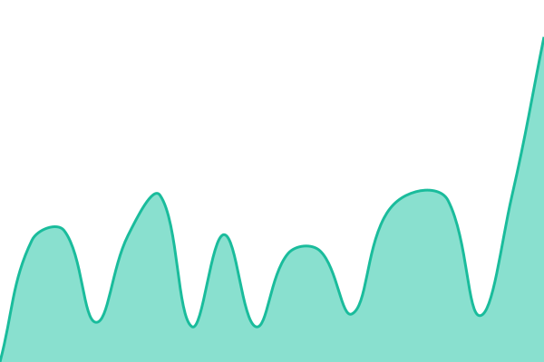
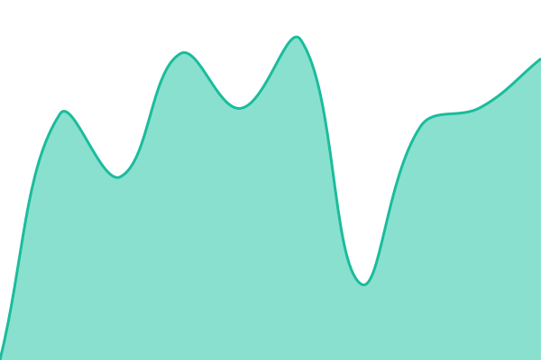

# [📈 Live Status](https://SF1981.github.io/upptime): <!--live status--> **🟧 Partial outage**

This repository contains the open-source uptime monitor and status page for [SF1981](https://SF1981.github.io/upptime), powered by [Upptime](https://github.com/upptime/upptime).

With [Upptime](https://upptime.js.org), you can get your own unlimited and free uptime monitor and status page, powered entirely by a GitHub repository. We use [Issues](https://github.com/SF1981/upptime/issues) as incident reports, [Actions](https://github.com/SF1981/upptime/actions) as uptime monitors, and [Pages](https://SF1981.github.io/upptime) for the status page.

<!--start: status pages-->
<!-- This summary is generated by Upptime (https://github.com/upptime/upptime) -->
<!-- Do not edit this manually, your changes will be overwritten -->
<!-- prettier-ignore -->
| URL | Status | History | Response Time | Uptime |
| --- | ------ | ------- | ------------- | ------ |
|  [Bada Bar (www)](https://www.bada-bar.fr) | 🟩 Up | [bada-bar-www.yml](https://github.com/SF1981/upptime/commits/HEAD/history/bada-bar-www.yml) | 

 626ms
     
 | 

<a href="https://SF1981.github.io/upptime/history/bada-bar-www">100.00%</a>
    

|  [Bada Bar (apex)](https://bada-bar.fr) | 🟩 Up | [bada-bar-apex.yml](https://github.com/SF1981/upptime/commits/HEAD/history/bada-bar-apex.yml) | 

 569ms
     
 | 

<a href="https://SF1981.github.io/upptime/history/bada-bar-apex">100.00%</a>
    

|  [Bus Paradise](https://www.bus-paradise.com) | 🟩 Up | [bus-paradise.yml](https://github.com/SF1981/upptime/commits/HEAD/history/bus-paradise.yml) | 

 1360ms
     
 | 

<a href="https://SF1981.github.io/upptime/history/bus-paradise">100.00%</a>
    

|  [Batirenove](https://www.bati-renovation.com) | 🟥 Down | [batirenove.yml](https://github.com/SF1981/upptime/commits/HEAD/history/batirenove.yml) | 

 1765ms
     
 | 

<a href="https://SF1981.github.io/upptime/history/batirenove">83.89%</a>
    

|  [Sortir Lyon](https://www.sortir-lyon.com) | 🟩 Up | [sortir-lyon.yml](https://github.com/SF1981/upptime/commits/HEAD/history/sortir-lyon.yml) | 

 1920ms
     
 | 

<a href="https://SF1981.github.io/upptime/history/sortir-lyon">99.15%</a>
    

|  [Bada Club](https://bada-club.fr) | 🟩 Up | [bada-club.yml](https://github.com/SF1981/upptime/commits/HEAD/history/bada-club.yml) | 

 1603ms
     
 | 

<a href="https://SF1981.github.io/upptime/history/bada-club">100.00%</a>
    

<!--end: status pages-->

[**Visit our status website →**](https://SF1981.github.io/upptime)

## 📄 License

- Powered by: [Upptime](https://github.com/upptime/upptime)
- Code: [MIT](./LICENSE) © [Anand Chowdhary](https://anandchowdhary.com)
- Data in the `./history` directory: [Open Database License](https://opendatacommons.org/licenses/odbl/1-0/)
